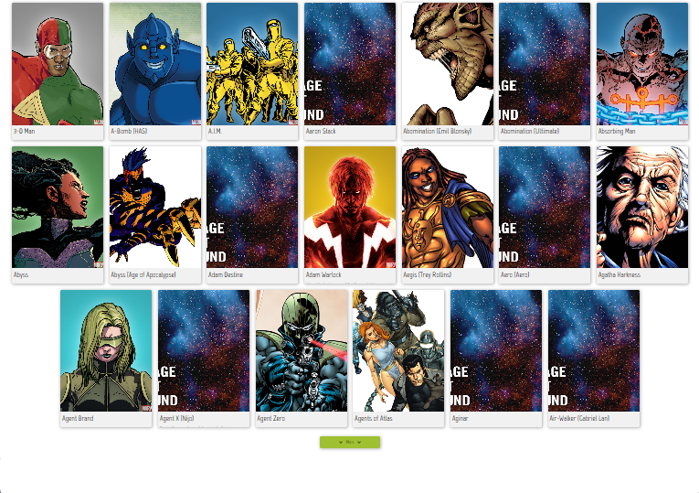

<h1 align="center">
 
   
  Projeto: Marvel API
</h1>

  <a href="#-tecnologias">Tecnologias</a>&nbsp;&nbsp;&nbsp;|&nbsp;&nbsp;&nbsp;
  <a href="#-projeto">Projeto</a>&nbsp;&nbsp;&nbsp;|&nbsp;&nbsp;&nbsp;
  <a href="#-deploy-do-projeto">Deploy do Projeto</a>&nbsp;&nbsp;

 

<h2>🖥️ Tela principal: </h2>

  

 

## ✨ Tecnologias

Esse projeto foi desenvolvido com as seguintes tecnologias:

- [ReactJS](https://reactjs.org)
- [React Icons](https://react-icons.github.io/react-icons/search)
- [TypeScript](https://www.typescriptlang.org)
- [Axios](https://axios-http.com/docs/intro)
- [HTML5](https://developer.mozilla.org/pt-BR/docs/Web/HTML)
- [Styled Components](https://styled-components.com)
- [Marvel API](https://developer.marvel.com)
- [md5](https://www.npmjs.com/package/md5)
- [ESLint](https://eslint.org/)

 

## 💻 Projeto

Esse projeto consiste em uma aplicação para mostrar os personagens, criadores, séries, quadrinhos e etc da Marvel, informações e curiosidades importantes sobre cada um.

 
  
 

## 🚀 Como executar

- Clone o repositório
- Vá ao site da [Marvel](https://developer.marvel.com), crie sua conta e pegue suas chaves (pública e privada)
- Instale o [NPM](https://www.npmjs.com)
- Instale as dependências com `npm install` no terminal

---
 
 

<h2>ATENÇÃO</h2>

- Exemplo de como utilizar variáveis de ambiente no ReactJS:

1º Passo criar um arquivo `.env`, fica junto com os arquivos lá de fora Eslint e etc `.env` colocar:

REACT_APP_CHAVE_API=chaveQueVcPegarDoSite

2º Passo criar uma pasta dentro do `src` como `config` ou qualquer outro nome achar melhor, dentro dessa pasta `config`, criar uma arquivo exemplo PrivateAPI.ts, colocar seguinte code:

export const ENV = {ChaveAPI:process.env.REACT_APP_CHAVE_API}

Obs: nome dado no arquivo `.env` PrivateAPI, é o mesmo que ira utilizar no 
export const ENV = {ChaveAPI:process.env.REACT_APP_CHAVE_API(`.env`)}. 

3º Passo ir no arquivo `.gitgnore`, # misc e acressentar 

.env ;

esse arquivo é pessoal, não compartilhe com ninguem.

4º Passo ir no arquivo que sua chave privada do API, retirar sua chave privada e inserir

<h2>Antes</h2>

const privateKey = (sua chave privada)

<h2>Depois</h2>

const privateKey = ENV.ChaveAPI || ' '

---

